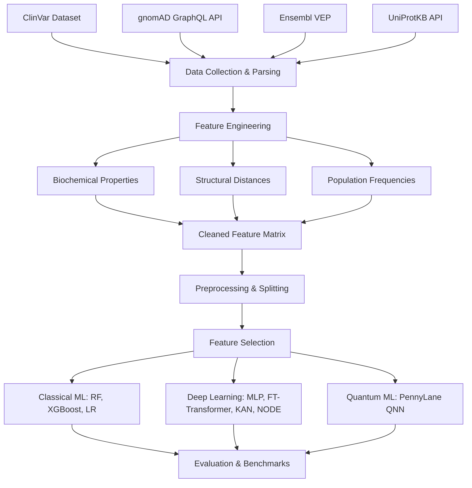

# Quantum-Enhanced Genetic Variant Pathogenicity Prediction

[](https://www.python.org/downloads/release/python-3100/)
[](https://opensource.org/licenses/MIT)

An end-to-end multi-modal bioinformatics pipeline and machine learning benchmark suite for classifying the pathogenicity of genetic variants. This project integrates genomic data from **ClinVar**, population allele frequencies from **gnomAD v4**, functional consequence annotations from **Ensembl VEP**, and protein biochemical/structural features from **UniProtKB**. 

It evaluates classical Machine Learning models, deep tabular architectures, and a **Variational Quantum Classifier (QNN)** built with PennyLane.

---

## 🧬 Architecture & Pipeline



---

## 📊 Benchmark Leaderboard

Models are evaluated on a hold-out test set using a unified set of biologically selected features.

| Rank | Model | Accuracy | F1 Score | ROC-AUC | PR-AUC | MCC |
|------|-------|----------|----------|---------|--------|-----|
| 1 | **Random Forest** | 0.947 | 0.961 | 0.984 | 0.990 | 0.879 |
| 2 | **XGBoost** | 0.928 | 0.947 | 0.982 | 0.991 | 0.837 |
| 3 | **PyTorch MLP** | 0.904 | 0.931 | 0.970 | 0.985 | 0.774 |
| 4 | **NODE** | 0.847 | 0.896 | 0.944 | 0.973 | 0.632 |
| 5 | **KAN** | 0.862 | 0.900 | 0.922 | 0.961 | 0.680 |
| 6 | **FT-Transformer** | 0.807 | 0.837 | 0.932 | 0.969 | 0.663 |
| 7 | **Logistic Regression**| 0.806 | 0.836 | 0.927 | 0.967 | 0.661 |
| 8 | **PennyLane QNN** | 0.824 | 0.867 | 0.903 | 0.959 | 0.612 |

---

## ⚙️ Repository Structure

```
BioInformatics/
├── config/              # Pipeline configuration (paths, hyperparameters)
├── data/                # Data storage (raw, processed, external)
├── docs/                # Documentation and figures
├── models/              # Saved model checkpoints and artifacts
├── notebooks/           # Jupyter notebooks for EDA and exploration
├── pipelines/           # Reproducible CLI runner scripts
├── src/                 # Core Python modules
│   ├── data/            # Data ingestion and annotation parsing
│   ├── features/        # Biochemical and structural feature engineering
│   ├── preprocessing/   # Imputation, scaling, and feature selection
│   ├── models/          # Model architectures (Classical, Deep, Quantum)
│   ├── evaluation/      # Metrics and visualizations
│   └── utils/           # Helper functions
└── tests/               # Unit and integration tests
```

---

## 🚀 Getting Started

### 1. Environment Setup

Ensure you have Conda installed, then create the environment:

```bash
conda env create -f environment.yml
conda activate bioinfo
```

### 2. Running the Pipeline

The entire project is structured into sequential reproducible pipelines:

```bash
# 1. Fetch, parse, and merge biological annotations
python pipelines/01_data_collection.py

# 2. Engineer biochemical features and clean dataset
python pipelines/02_feature_engineering.py

# 3. Perform train/val/test splits and fit scalers/imputers
python pipelines/03_preprocessing.py

# 4. Train Classical, Deep Tabular, and Quantum models
python pipelines/04_train_models.py

# 5. Evaluate benchmarks and generate leaderboard
python pipelines/05_evaluate_benchmark.py
```

Alternatively, run the entire end-to-end suite:
```bash
python pipelines/run_all.py
```

---

## 🧪 Quantum Neural Network (QNN)

The Variational Quantum Classifier is built using **PennyLane** and integrates with PyTorch. It leverages:
- **Angle Embedding**: Encodes classical continuous features into quantum states via rotations (Rx, Ry, Rz).
- **Strongly Entangling Layers**: A sequence of single-qubit rotations and CNOT gates that span the Hilbert space to model complex feature interactions.
- **Pauli-Z Measurements**: Extracts expectation values to compute the classification logits.

---

## 📝 License

This project is licensed under the MIT License - see the LICENSE file for details.
